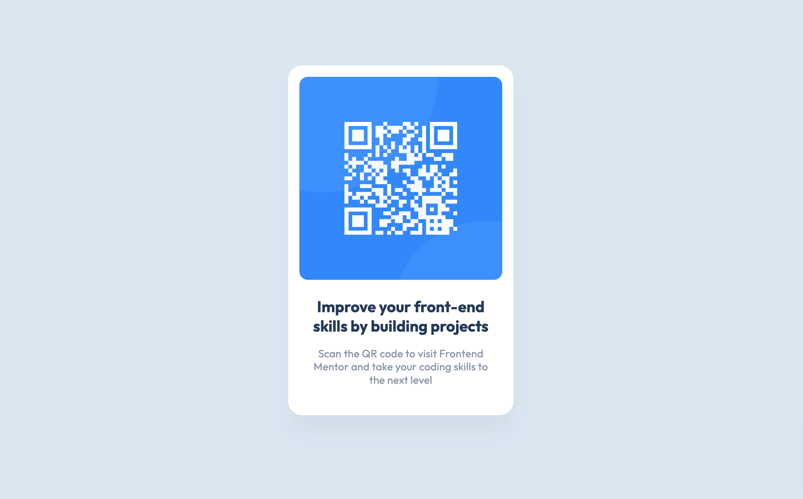

# Frontend Mentor - QR code component solution

This is a solution to the [QR code component challenge on Frontend Mentor](https://www.frontendmentor.io/challenges/qr-code-component-iux_sIO_H). Frontend Mentor challenges help you improve your coding skills by building realistic projects. 

## Table of contents

- [Overview](#overview)
  - [Screenshot](#screenshot)
  - [Links](#links)
- [My process](#my-process)
  - [Built with](#built-with)
- [Author](#author)

**Note: Delete this note and update the table of contents based on what sections you keep.**

## Overview

### Screenshot

### Links

- Solution URL: [https://github.com/web2feel/qrcode-fe-mentor](https://github.com/web2feel/qrcode-fe-mentor)
- Live Site URL: [https://qrcode-fe-mentor.netlify.app](https://qrcode-fe-mentor.netlify.app)

## My process

### Built with

- Mobile-first workflow
- [React](https://reactjs.org/) - JS library
- [TailwindCSS](https://tailwindcss.com/) - CSS library

## Author

- Frontend Mentor - [@web2feel](https://www.frontendmentor.io/profile/web2feel)
- Twitter - [@jinson_dev](https://www.twitter.com/jinson_dev)

